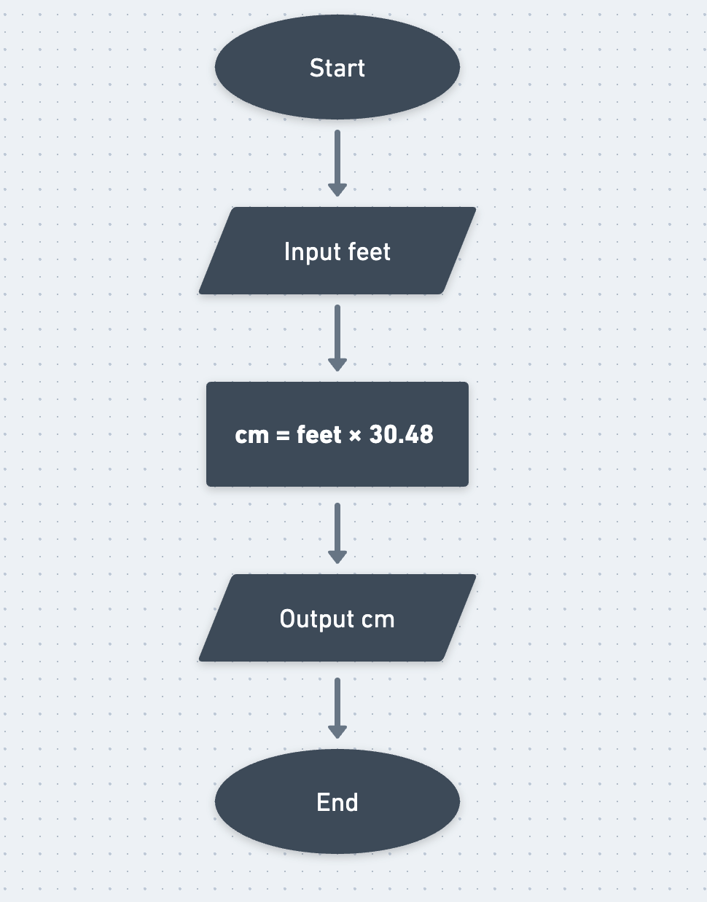
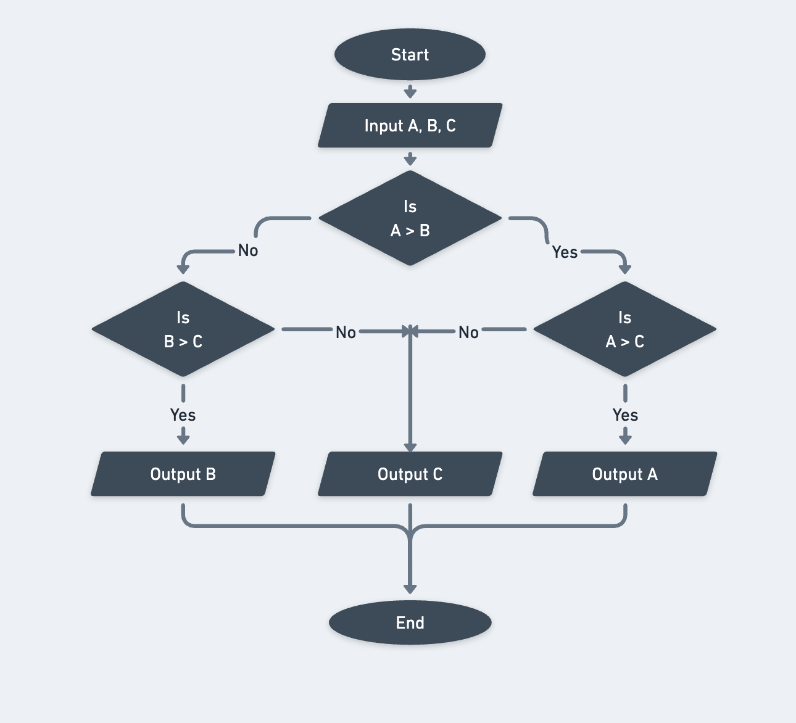
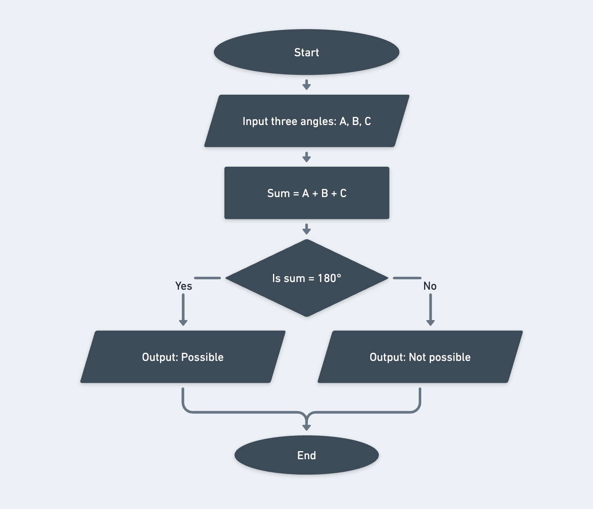

# Flowchart Exercises

## Requirements

- Clone this repository to your local machine.
- Create a pseudocode and draw a flowchart for the following exercises.
- You should use [Whimsical](https://whimsical.com) to draw the flowcharts.
- Take a screenshot and add each flowchart to the `flowcharts` folder. Use the command line to create the folder.
- Add each flowchart to the answer section of this file as image.
- Each exercise should be in a different commit.
- If you want to make changes after your commit, you should create a new commit.

## Exercise 1

Write an algorithm and draw a flowchart to convert the length in feet to centimeters.

Pseudocode:

- Input length in feet (LFT)
- Calculate the length in cm (LCM) by multiplying LFT by 30
- Print length in cm (LCM)

### _Answer_
1.	Start
2.	Input feet 
3.	Calculate cm = feet * 30.48 cm 
4.	Output cm 
5.	End 

## Exercise 2

Write an algorithm and draw a flowchart that will read the two sides of a rectangle and calculate its area.

Pseudocode:

- Input the width (W) and the length (L) of a rectangle
- Calculate the area (A) by multiplying W by L
- Print A

### _Answer_

1.	Start 
2.	Input the length 
3.	Input the width 
4.	Calculate area 
5.	Output the area 
6.	End 

## Exercise 3

Write an algorithm and draw a flowchart that will read three numbers and prints the value of the largest number.

> Given that the three numbers are not equal to each other)

### _Answer_

1.	Start
2.	Input A, B, C
3.	If   A > B
    ->  If  A > C
     -> Output  A
-> Else 
         -> Output C
4.	Else 
             -> If   B > C
                -> Output B
             -> Else 
                -> Output C 
5.	End

## Exercise 4

Write an algorithm and draw a flowchart to check the three number inputs whether a triangle is possible or not.

### _Answer_

Ex 4
1: Start
2: Input three angles: A, B, and C
3: Calculate the sum → sum = A + B + C
4: If sum == 180
    → Output "Possible"
 5: Else
    → Output "Not possible"
6: End

## Exercise 5

Draw the flowchart for the following:

Accept the name and marks obtained by a student in Computer Project.

Display the grades as per the table given below:

| Marks obtained                | Grade    |
| ----------------------------- | -------- |
| 80% or more                   | A        |
| 60% or more but less than 80% | B        |
| 40% or more but less than 60% | C        |
| Less than 40%                 | No Grade |

### _Answer_

